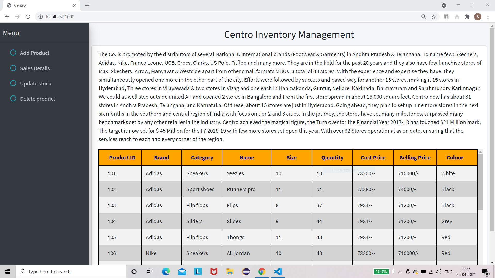
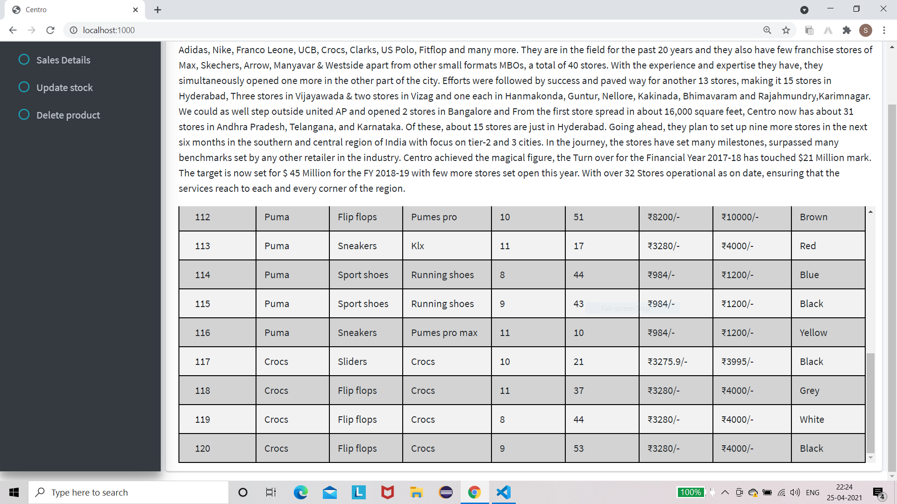
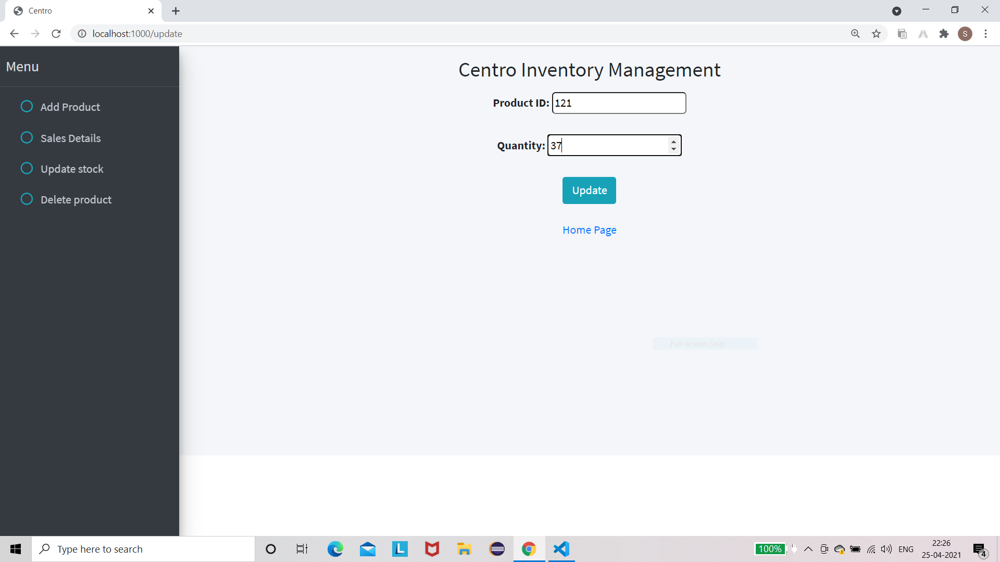
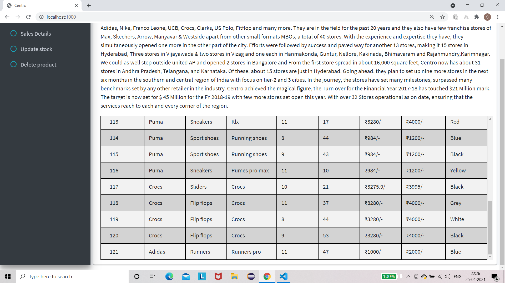
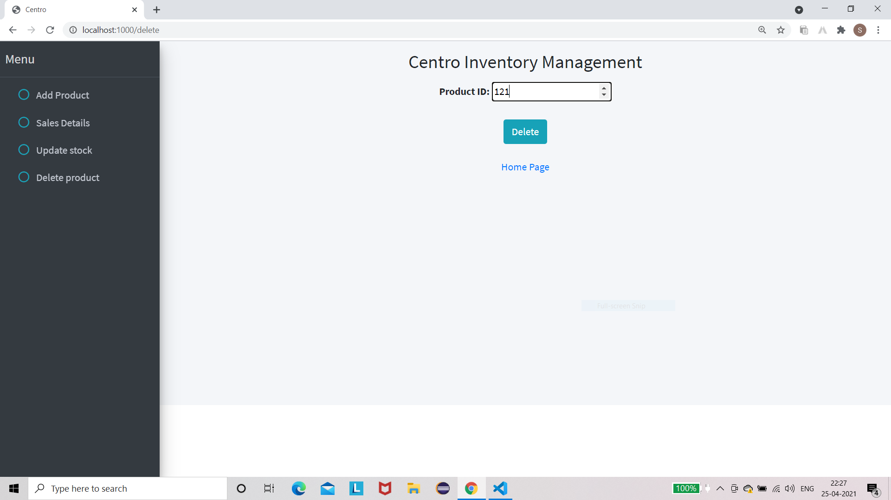
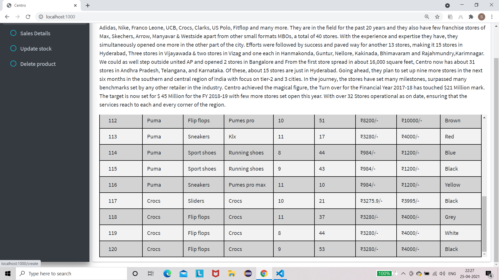

# centro
<h1>CENTRO INVENTORY MANAGEMENT</h1>
The following repository contains the code for Inventory Management implementing CRUD Operations using MongoDB, ExpressJS, EJS, AdminLTEBootstrap (front-end)
The following is the home page of the inventory management performing CRUD Operations
<strong>[i]Home Page</strong>

   
 
 The following is the number of records the home page displays from our database stock

 <strong>[ii]Home Page</strong>

   
 
 The following is the front end for adding a new product in our database stock

 <strong>[iii]add Page</strong>

   
 
 adding a new product in our database stock

 <strong>[iv]add Page</strong>

   
 
 update of a new product added in our database stock

 <strong>[v]add Page</strong>

   
 
 update of a stock/quantity of product in our database stock

 <strong>[vi]Update Page</strong>

   
 
 update of a stock/quantity of product in our database stock reflected in the db

 <strong>[vii]Update Page</strong>

   
 
 delete product added in our database

 <strong>[viii]Delete Page</strong>

   
 
 delete product added in our database

 <strong>[ix]Delete Page</strong>

   
